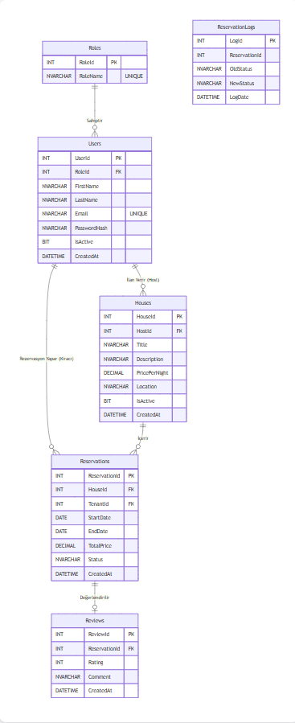
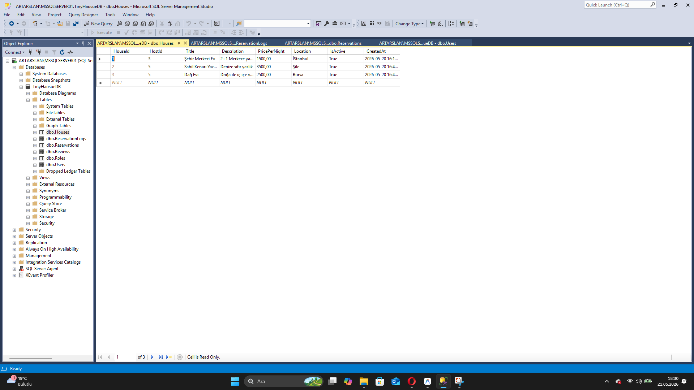
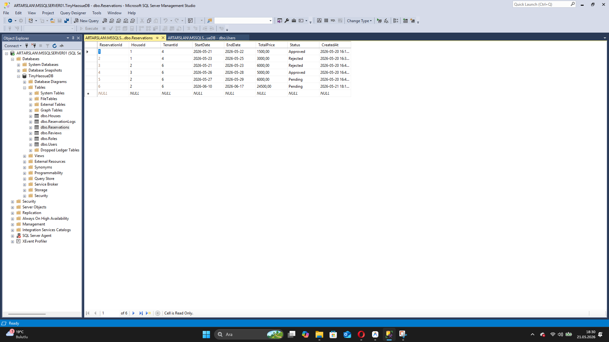
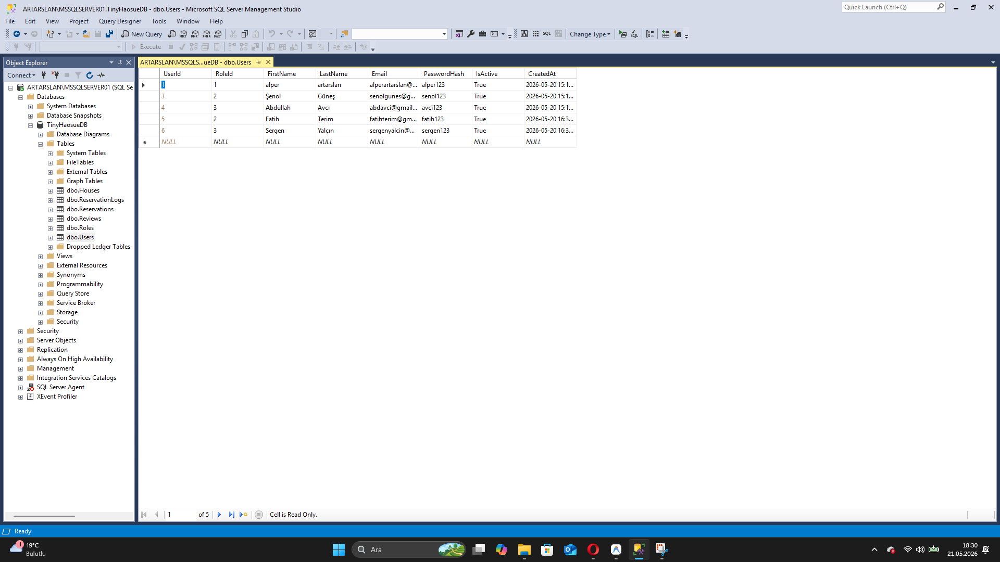

# Tiny House Rezervasyon ve Yönetim Sistemi 🏠

Bu proje, kullanıcıların tiny house konseptindeki evleri inceleyip rezervasyon yapabildiği, ev sahiplerinin ilanlarını yönetebildiği ve sistem yöneticisinin (Admin) tüm verileri kontrol altında tuttuğu 3 rollü (Admin, Ev Sahibi, Kiracı) bir rezervasyon yönetim sistemidir.

## 🚀 Kullanılan Teknolojiler

- **Backend:** Python, Flask Framework
- **Frontend:** HTML, CSS, JavaScript (Jinja2)
- **Veritabanı:** Microsoft SQL Server (MSSQL), `python-tds`

## 👥 Kullanıcı Rolleri ve Özellikler

### 1. Admin (Sistem Yöneticisi)
- Sistemdeki toplam veriyi ve finansal durumu dashboard üzerinden görüntüleme.
- Kullanıcıları aktif/pasif hale getirme veya sistemden silme.
- İlanları yayından kaldırma ve yapılan rezervasyonları iptal etme.

### 2. Ev Sahibi (Host)
- Sisteme yeni bir Tiny House ilanı ekleme.
- Mevcut ilanların açıklamasını, fiyatını düzenleme veya yayından kaldırma.
- Gelen rezervasyon isteklerini onaylama veya reddetme.
- Misafir yorumlarını inceleme.
- Toplam ev sayısını ve net geliri (onaylanmış rezervasyonlardan) anlık olarak görüntüleme.

### 3. Kiracı (Tenant)
- Aktif ev ilanları arasında arama yapma.
- Ev detaylarını görüntüleme, tarihsel çakışma kontrolü ile müsait tarihlerde rezervasyon yapma.
- Geçmiş rezervasyonları iptal edebilme.
- Konaklanan evlere 1-5 arası yıldız verme ve yorum yazma.

## 🗄️ Veritabanı Mimarisi (MSSQL)

Sistemdeki gereksinimler ve iş kuralları büyük ölçüde veritabanı seviyesinde çözülmüştür:

- **Normalizasyon:** 3NF kurallarına uygun tasarım.
- **Stored Procedures (SP):** `sp_AddReservation` (Rezervasyon Ekleme) ve `sp_UpdateUserStatus` (Kullanıcı Durumu Değiştirme) gibi işlemler.
- **Functions:** `fn_CheckHouseAvailability` (Müsaitlik kontrolü) ve `fn_CalculateTotalIncome` (Kazanç hesaplama).
- **Triggers:** `trg_AfterReservationUpdate` ile loglama, `trg_PreventAdminDelete` ile sistem yöneticisi silinmesini engelleme.
- **Constraints (Kısıtlamalar):** `UNIQUE`, `CHECK` (Fiyat > 0, Bitiş Tarihi > Başlangıç Tarihi, Puan: 1-5) ve `NOT NULL` kullanımları.

### ER Diyagramı


## ⚙️ Kurulum ve Çalıştırma

1. Projeyi bilgisayarınıza indirin.
2. Gerekli Python kütüphanelerini kurun:
   ```bash
   pip install -r requirements.txt
   ```
3. Veritabanını oluşturmak için SQL Server'da `database_setup.sql` dosyasındaki betikleri çalıştırın.
4. `app.py` içerisindeki veritabanı bağlantı ayarlarını (sunucu adı, kullanıcı adı, şifre vb.) kendi SQL Server'ınıza göre güncelleyin.
5. Uygulamayı başlatın:
   ```bash
   python app.py
   ```
6. Tarayıcınızda `http://localhost:5000` adresine giderek uygulamayı kullanmaya başlayabilirsiniz.

## 📸 Ekran Görüntüleri

| Evler | Rezervasyonlar | Kullanıcılar |
|-------|----------------|--------------|
|  |  |  |

---
*Bu proje İleri Veri Tabanı dersi kapsamında geliştirilmiştir.*
